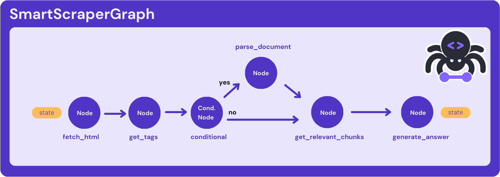

# 👽 Example
First of all you have to install the library 
```python
pip install scrapegraphai
```
## Python code
SmartScraper is a class representing one of the default scraping pipelines. It uses a direct graph implementation where each node has its own function, from retrieving html from a website to extracting relevant information based on your query and generate a coherent answer.

#

```python
from scrapegraphai.graphs import SmartScraper

OPENAI_API_KEY = "YOURAPIKEY"

llm_config = {
    "api_key": OPENAI_API_KEY,
    "model_name": "gpt-3.5-turbo",
}

smart_scraper = SmartScraper("List me all the titles and project descriptions",
                             "https://perinim.github.io/projects/", llm_config)

answer = smart_scraper.run()
print(answer)
```
```bash
Fetching pages: 100%|##########| 1/1 [00:00<00:00,  3.20it/s]
---GET PROBABLE TAGS---
Possible tags:  h1 h2 h3 h4 h5 h6 p
---GENERATE ANSWER---
{'projects': [{'title': 'Rotary Pendulum RL', 'description': 'Open Source project aimed at controlling a real life rotary pendulum using RL algorithms'}, {'title': 'DQN Implementation from scratch', 'description': 'Developed a Deep Q-Network algorithm to train a simple and double pendulum'}, {'title': 'Multi Agents HAED', 'description': 'University project which focuses on simulating a multi-agent system to perform environment mapping. Agents, equipped with sensors, explore and record their surroundings, considering uncertainties in their readings.'}, {'title': 'Wireless ESC for Modular Drones', 'description': 'Modular drone architecture proposal and proof of concept. The project received maximum grade.'}]}
```
```python
answer["projects"][0]
```
```bash
{'title': 'Rotary Pendulum RL',
 'description': 'Open Source project aimed at controlling a real life rotary pendulum using RL algorithms'}
 ```
