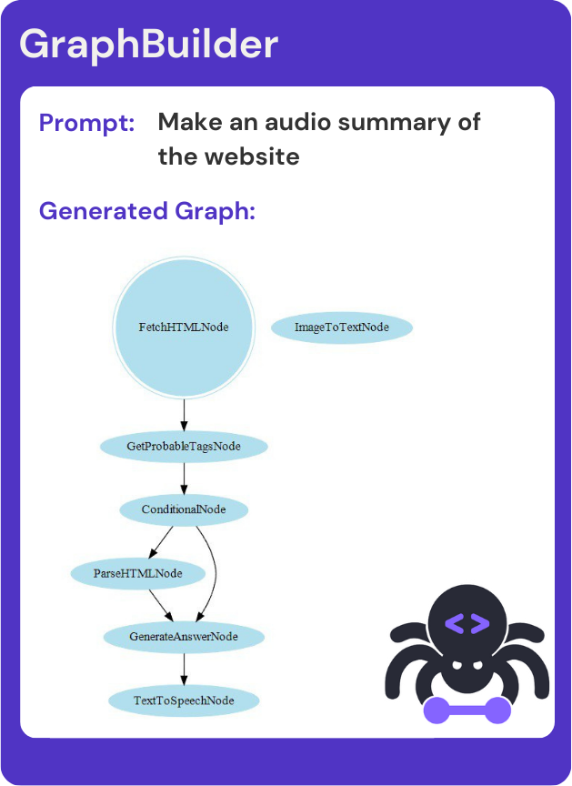

# 🍇 GraphBuilder
```python
# if you plan on using text_to_speech and GPT4-Vision models be sure to use the
# correct APIKEY
OPENAI_API_KEY = "YOUR_API_KEY"
```

**GraphBuilder** is an experimental class that helps you to create custom graphs based on your prompt. It creates a json with the essential elements that identify a graph and allows you to visualize it using **graphviz**. It knows what are the kind of nodes that the library provides by default and connect them to help you reach your goal.

```python
from scrapegraphai.builders import GraphBuilder

llm_config = {
    "api_key": OPENAI_API_KEY,
    "model_name": "gpt-3.5-turbo",
    "temperature": 0,
    "streaming": True
}

# Example usage of GraphBuilder
user_prompt = "Extract the news and generate a text summary with a voiceover."
graph_builder = GraphBuilder(user_prompt, llm_config)
graph_json = graph_builder.build_graph()

# Convert the resulting JSON to Graphviz format
graphviz_graph = graph_builder.convert_json_to_graphviz(graph_json)
print(graph_json)
```
```bash
{'input': 'Extract the news and generate a text summary with a voiceover.',
 'text': [{'nodes': [{'node_name': 'FetchHTMLNode', 'node_type': 'node'},
    {'node_name': 'GetProbableTagsNode', 'node_type': 'node'},
    {'node_name': 'ParseHTMLNode', 'node_type': 'node'},
    {'node_name': 'GenerateAnswerNode', 'node_type': 'node'},
    {'node_name': 'ConditionalNode', 'node_type': 'conditional_node'},
    {'node_name': 'ImageToTextNode', 'node_type': 'node'},
    {'node_name': 'TextToSpeechNode', 'node_type': 'node'}],
   'edges': [{'from': 'FetchHTMLNode', 'to': ['GetProbableTagsNode']},
    {'from': 'GetProbableTagsNode', 'to': ['ParseHTMLNode']},
    {'from': 'ParseHTMLNode', 'to': ['GenerateAnswerNode', 'ConditionalNode']},
    {'from': 'ConditionalNode',
     'to': ['ImageToTextNode', 'TextToSpeechNode']}],
   'entry_point': 'FetchHTMLNode'}]}

```